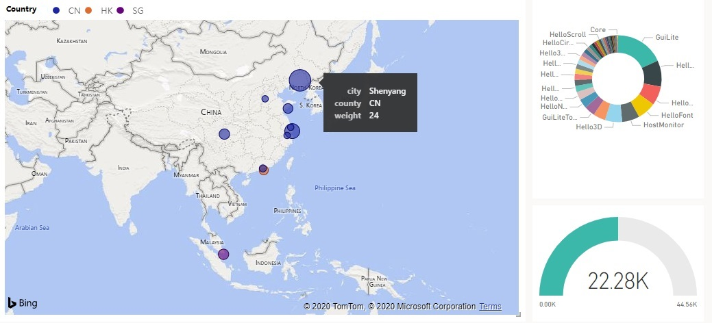

## Microsoft Azure IoT
Microsoft Azure IoT solution is very powerful for small busyness, you can control/update your device at any time over the world.

In this solution, you do not need download tons of source code from Microsoft official websit, Just build it quickly locally within few steps.

We have 2 IoT solutions here:
1. [BuildAzurePnp](BuildAzurePnp/README.md): For resource limited device, such as: light switch, smart
2. [BuildAzureIotEdge](BuildAzureIotEdge/README.md): For IoT edge device, such as: AI solution

## BuildAzurePnp
BuildAzurePnp runs on Linux. You should install GCC before build it.

## BuildAzureIotEdge
BuildAzureIotEdge runs on Linux Docker. You should install Docker before build it.

## Q&A
If you meet any question about Azure IoT, please contact us in "Super QQ group", the specialist will answer your question.