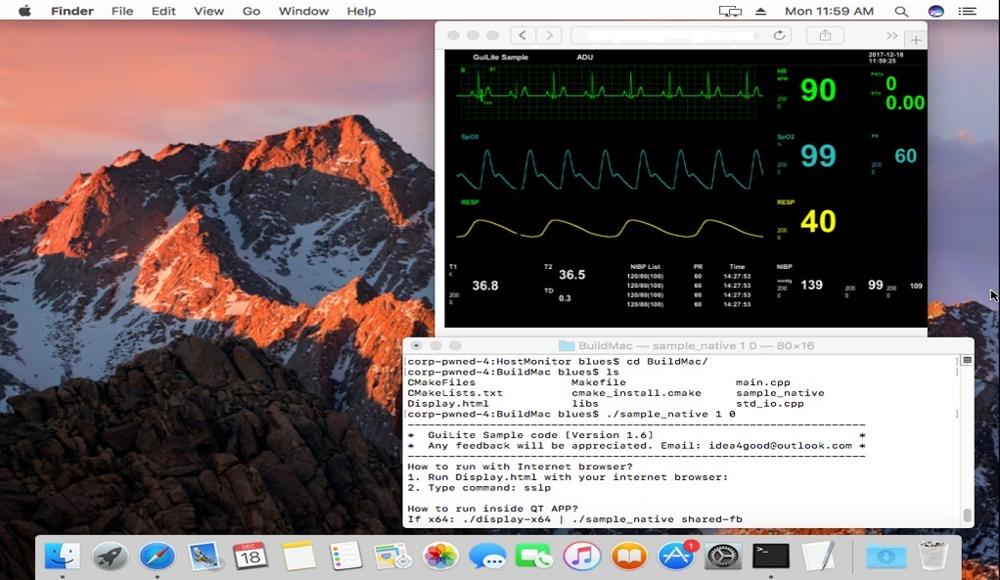
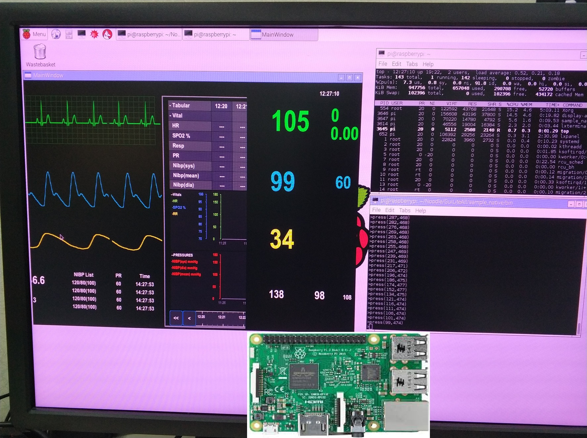

# GuiLite Samples - Do amazing things! QQ group: `527251257`

[中文](doc/README-cn.md)

We hope you can learn how [GuiLite](https://github.com/idea4good/GuiLite) work by this samples.

You also can get GuiLite code in repo "GuiLite" now. It's pretty simple code, no more than 6000 lines.

Here are snapshots when running, enjoy it!

Run on Android:

Run on Mac:

Run on Windows mixed reality device:

Run on Linux:

Run on RaspberryPi:
