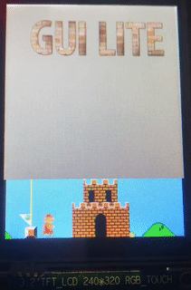

    

# GuiLite Samples - Crack GuiLite with live demo
     

[中文](README_zh.md)
- GuiLite samples contain 13 cross-platform projects. They all based on [GuiLite](https://github.com/idea4good/GuiLite). They could show you how to use GuiLite's interface, and how GuiLite works on iOS, Android, GNU/Linux, Windows and macOS platform.
- GuiLite samples could pass compiling in 100%, could run on all kinds of PC, phones, MCU and embedded(IoT) devices.
- Suppoort IDE: Visual Studio, Qt Creator, Keil 
- GuiLite Samples could run on web page, and make 3D feature with WebGL, visit [GuiLiteWeb](https://github.com/idea4good/GuiLiteWeb) to get more details
- GuiLite samples could run in **Docker container** with single command below:
  - `sudo docker run -it --privileged -v /dev:/dev-share idea4good/gui-lite:latest bash /run.sh`

## MCU demos: Hello Star + Hello Particle + Hello Wave + Hello NoTouch + Hello Mario + Hello Nets + Hello 3D
&nbsp;&nbsp;&nbsp;&nbsp;&nbsp;&nbsp;&nbsp;&nbsp;&nbsp;&nbsp;
- MCU Hardware: STM32F103ZET6(512K ROM, 64K RAM) + 240*320 16bits color TFT LCD
- MCU Software: No OS, Only GuiLite
- Hello Star has [100+ lines code](HelloStar/UIcode/UIcode.cpp), showing you how to develop a star field effect.
- Hello Particle has [100- lines code](HelloParticle/UIcode/UIcode.cpp), showing you how to develop a particle effect.
- Hello Wave has [100+ lines code](HelloWave/UIcode/UIcode.cpp), showing you how to use wave widget.
- Hello NoTouch has only [100+ lines code](HelloNoTouch/UIcode/UIcode.cpp), showing you how to navigate/click widgets by hard button in non-touch GUI scenario.
- Hello Mario has [100+ lines code](HelloMario/UIcode/UIcode.cpp), showing you how to develop a multi-layer UI system.
- Hello Nets has only [100+ lines code](HelloNets/UIcode/UIcode.cpp), showing you how to build 3D effect.
- Hello 3D has only [100+ lines code](Hello3D/UIcode/UIcode.cpp), it's a lightweight 3D engine base on GuiLite.
- [How to porting for any MCU?](HelloWave/README.md#how-to-port-on-any-type-of-mcu)
- Also support: Windows / Linux

## Hello 3D

Hello 3D is a ligheweight(MCU level) 3D engine base on GuiLite.
- Could run on limited resource hardware
- Could build a 3D object quickly, and run it on different platform(e.g, Windows, Linux, MCU, Qt)
- Could upgrade your UI experience with a little 3D feature

## Hello Nets

Hello Nets has only [100+ lines code](HelloNets/UIcode/UIcode.cpp) for beginner, showing you how to build 3D physics App with GuiLite. You can run it on Windows, Linux and MCU.

## Hello Widgets

Hello Widgets has only [100+ lines code](HelloWidgets/UIcode/UIcode.cpp) for beginner, showing you how to develop GUI with GuiLite widgets. You can run it on Windows and Linux.

## Hello Animation

Hello Animation has only [100+ lines code](HelloAnimation/UIcode/UIcode.cpp) for beginner, showing you how to making animation. You can run it on Windows and Linux.

## Hello Slide

Hello Slide has only [100+ lines code](HelloSlide/UIcode/UIcode.cpp). It shows beginner how to make sliding UI. You can run it on Windows and Linux.

## Hello Font

Hello Font has only [100+ lines code](HelloFont/UIcode/UIcode.cpp) .It shows beginner how to use multi-language feature(UTF-8). You can run it on Windows and Linux.

## Hello GuiLite

Hello GuiLite has only [100+ lines code](HelloGuiLite/UIcode/helloGL.cpp). It shows beginner how to initialize GuiLite, layout UI widgets, and map messages. You can run it on Windows and Linux.

## Host Monitor
On Mac & iOS:

 

On Android & ARM Linux embedded:

 

On Windows Mixed Reality:

Host Monitor has 2,000 lines of code related to UI, showing you how to make UI layout , and customize/extend your UI widgets.
### Code Description
- HostMonitor\UICode\source\ui_layout: **UI Layout**
- HostMonitor\UICode\source\ui_ctrl_ex: **Customize your widgets**

### Cross platform
- HostMonitor\BuildAndroid: **Java code, for Android**
- HostMonitor\BuildIOS: **Swift code, for iOS**
- HostMonitor\BuildLinux: **C code, for Linux**
- HostMonitor\BuildWin32: **C code, for Windows**
- HostMonitor\BuildUWP: **CX code, for UWP(include Mixed/Virtual Reality)**
- HostMonitor\BuildMacCmd: **Swift code, for Mac command mode**
- HostMonitor\BuildMacCocoa: **Swift code, for Mac APP with UI**
- HostMonitor\BuildGo: **Golang + C++, for Linux**

[Build "host monitor"](HostMonitor/README.md)

[UART on Android phone](doc/Serial.md)

[Download Android APP](http://zhushou.360.cn/detail/index/soft_id/1754231)

## Suggestions
Looks complex? Trust me that you can do everything we did because we are the same.
- Dare to build it
- Dare to make your own modification
- Dare to create your UI framework

## Repository Mirror
[Gitee in China](https://gitee.com/idea4good/GuiLiteSamples)

## Thanks
Thanks the help from QQ group, you guys make GuiLite better! And welcome to join us. 