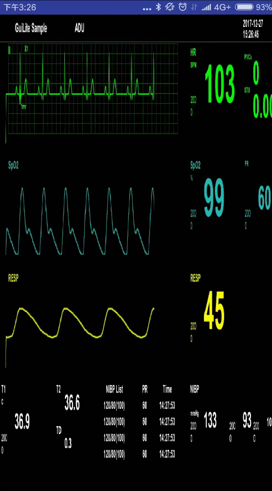

# GuiLite Samples - 等待你的精彩 - 开发者qq群: `527251257`

UI的本质不过6千行的[GuiLite](https://github.com/idea4good/GuiLite)而已。冲破框架的束缚，你也能谱写美丽华章

离开了轻量，GuiLite什么都不是；有了轻量，它就可以高效运行在Android、Linux、Windows、Mac、VR、MCU、嵌入式设备上。

Android上的运行效果:

Mac上的运行效果:

虚拟现实上的运行效果:

Linux上的运行效果:

树莓派上的运行效果:
