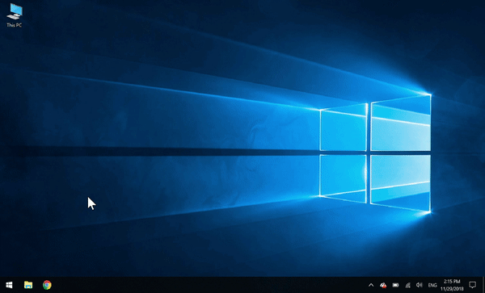

# GuiLite Samples - 是你造就了漂亮的界面，而不是UI框架
- GuiLite samples包括8个跨平台项目，他们都是基于[GuiLite](https://github.com/idea4good/GuiLite)编写的实际应用，用来说明GuiLite的接口使用方法，并让你的程序同时运行在：iOS，Android，Linux，Windows，Mac平台上。
- GuiLite samples编译成功率100%，可以运行在市面所有的：PC，手机，单片机及各种嵌入式（IoT）设备上。
- GuiLite samples可运行在**Docker容器**里面，具体命令如下:
  - `sudo docker run -it --privileged -v /dev:/dev-share idea4good/gui-lite:latest bash /run.sh`

## 单片机系列: Hello Mario + Hello Particle + Hello Wave + Hello Navigation
&nbsp;&nbsp;&nbsp;&nbsp;&nbsp;&nbsp;
- 单片机硬件配置：STM32F103ZET6(512K ROM，64K RAM) + 240*320 16位TFT屏
- 单片机软件配置：无操作系统 + GuiLite
- Hello Mario 仅有[100+行代码](../HelloMario/UIcode/UIcode.cpp)，重现了“超级玛丽”的游戏片段，用于向开发者展示：如何使用GuiLite进行多图层的开发。
- Hello Particle 仅有[100-行代码](../HelloParticle/UIcode/UIcode.cpp)，用于向开发者展示：如何使用GuiLite进行粒子效果的开发。
- Hello Wave 仅有[100+行代码](../HelloWave/UIcode/UIcode.cpp)，用于向开发者展示：如何使用GuiLite进行波形开发。
- Hello Navigation 仅有[100+行代码](../HelloNavigation/UIcode/UIcode.cpp)，用于向开发者展示：如何在非触摸屏场景下，使用硬按键进行：“移动焦点”和“点击”操作。
- [移植方法 -- 适用于任意单片机平台？](../HelloWave/README.md#How-to-port-on-any-MCU-)
- 该实例亦可支持Windows和Linux平台

## Hello Animation

Hello Animation 仅有[100多行代码](https://github.com/idea4good/GuiLiteSamples/blob/master/HelloAnimation/UIcode/UIcode.cpp)，用于向初学者展示：如何制作动画。该实例可支持Windows和Linux平台。

## Hello Slide

Hello Slide 仅有[100多行代码](https://github.com/idea4good/GuiLiteSamples/blob/master/HelloSlide/UIcode/UIcode.cpp)，用于向初学者展示：如何制作滑屏界面。该实例可支持Windows和Linux平台。

## Hello Font

Hello Font 仅有[100多行代码](https://github.com/idea4good/GuiLiteSamples/blob/master/HelloFont/UIcode/UIcode.cpp)，用于向初学者展示：如何基于UTF-8，实现多语言。该实例可支持Windows和Linux平台。

## Hello GuiLite

Hello GuiLite 仅有[100多行代码](https://github.com/idea4good/GuiLiteSamples/blob/master/HelloGuiLite/UIcode/helloGL.cpp)，用于向初学者展示：初始化GuiLite，布局UI元素，消息映射。该实例可支持Windows和Linux平台。

## Host Monitor
在iOS，Mac下的运行效果:

 

在Android，嵌入式ARM Linux下的运行效果:

 

在Windows混合现实下的运行效果:

HostMonitor有2千行UI代码, 用来布局UI和自定义控件
### 代码走读
- HostMonitor\UIcode\source\ui_layout: **布局UI**
- HostMonitor\UIcode\source\ui_ctrl_ex: **自定义控件**

### 跨平台办法
- HostMonitor\BuildAndroid: **Java 语言, 用于Android平台**
- HostMonitor\BuildIOS: **Swift code, 用于 iOS平台**
- HostMonitor\BuildLinux: **C 语言, 用于Linux平台**
- HostMonitor\BuildWin32: **C 语言, 用于Windows控制台**
- HostMonitor\BuildUWP: **CX 语言, 用于通用Windows平台(包括：虚拟/混合现实)**
- HostMonitor\BuildMacCmd: **Swift语言, 用于Mac命令行模式**
- HostMonitor\BuildMacCocoa: **Swift语言, 用于Mac图形应用**
- HostMonitor\BuildGo: **Go语言 & C++, 用于Linux平台**

[编译"host monitor"](HostMonitor/README.md)

[手机连串口设备](Serial.md)

[下载体验Android版App](http://zhushou.360.cn/detail/index/soft_id/1754231)

## 一些建议
是不是感觉很复杂？我们只是资质平庸的开发者，我们能做到的，你也可以！
- 敢于编译、运行
- 敢于修改代码
- 敢于开创自己的UI

## 代码镜像
[国内码云链接](https://gitee.com/idea4good/GuiLiteSamples)

## 致谢
感谢开发者群的所有同学，是你们塑造了今天的GuiLite！也欢迎你加入我们。

