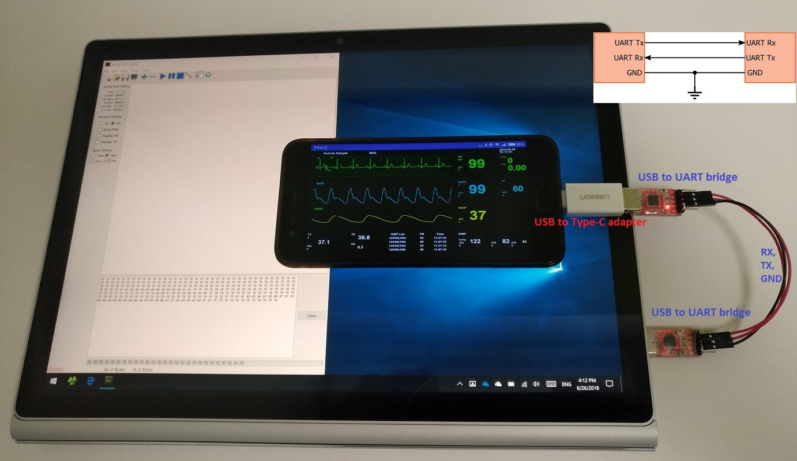
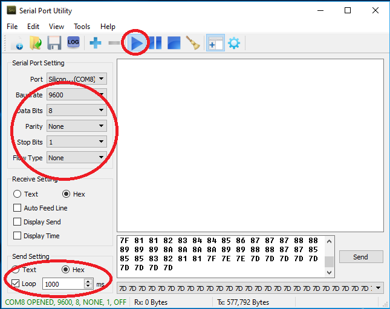
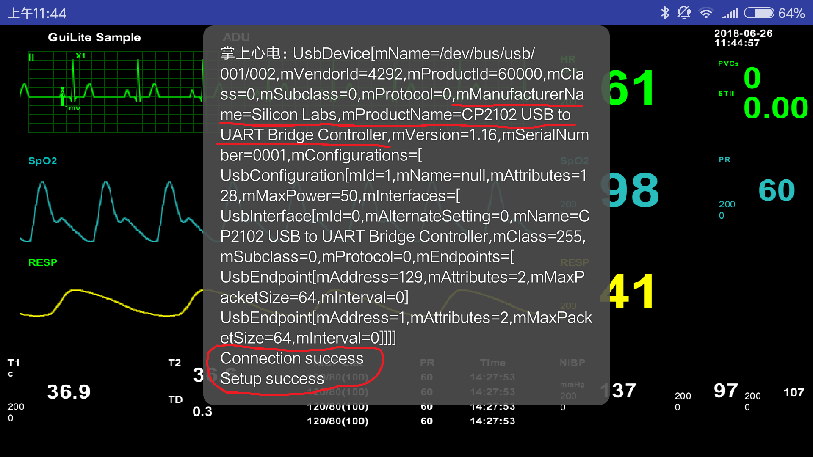

# How to use serial with Android phone？
With the help of serial calbe, you can connect external device with Android phone. In this case, the external device is PC.

## Prerequisite
In order to tranform USB singal of Android phone to serial signal, you need some hardware here.
### Android phone with micro USB port(support OTG)
OTG to UART bridge(手机USB转串口TTL适配器) -- CP210x-Silicon Labs will be recommended.
### Or Android phone with type-c USB port
1. Type-c to USB adapter.
2. USB to UART bridge -- CP210x-Silicon Labs will be recommended.
3. Connet 1 & 2, you got a type-c to UART bridge.
### PC side
USB to UART bridge

**Note: UART has TTL/RS232 types, choose one of them to use**

## How to connect?
Connect them like this:

## Send data on PC
Run serial tool on PC like this:

Send wave data:

`7D 7D 7D 7D 7D 7D 7D 7D 7D 7D 7D 7D 7D 7D 7D 7D 7D 7D 7D 7D 7D 7D 7D 7D 7D 7D 7D 7D 7D 7D 7D 7D 7D 7D 7D 7D 7D 7D 7D 7D 7D 7D 7D 7D 7D 7D 7D 7D 7D 7D 7D 7D 7D 7D 7D 7D 7D 7D 7D 7D 7D 7D 7D 7D 7D 7D 7D 7D 7D 7D 7D 7D 7D 7D 7D 7D 7D 7D 7D 7D 7D 7D 7D 7D 7D 7D 7D 7D 7D 7D 7D 7D 7D 7D 7D 7D 7D 7D 7D 7D 7D 7D 7D 7D 7D 7D 7D 7D 7D 7D 7D 7D 7E 7E 7F 81 81 82 82 83 84 84 84 84 83 82 82 81 81 7F 7F 7D 7D 7D 7D 7D 7D 7D 7D 7D 7D 7D 7D 7D 7D 7D 7D 7D 7D 7D 7D 7D 7D 7D 7C 7B 7A 79 7A 82 89 91 98 9F A2 9B 94 8C 85 7E 78 79 7A 7B 7D 7D 7D 7D 7D 7D 7D 7D 7D 7D 7D 7D 7D 7D 7D 7D 7D 7D 7D 7D 7D 7D 7D 7D 7D 7D 7D 7D 7D 7D 7D 7D 7D 7D 7E 7F 7F 81 81 82 83 84 84 85 86 87 87 87 88 88 89 89 89 8A 8A 8A 8A 89 89 88 88 87 87 85 85 85 83 82 81 81 7F 7E 7E 7D 7D 7D 7D 7D 7D 7D 7D 7D`

## Receive data on Android phone
Double click APP([source code](https://github.com/idea4good/GuiLiteSamples/tree/master/HostMonitor/BuildAndroid)), it will connect USB serial automaticlly.
You will see this if everything is ok:

## Links
[Demo video](https://v.youku.com/v_show/id_XMzY4OTYwMzk1Mg)

[Source code](https://github.com/idea4good/GuiLiteSamples/tree/master/HostMonitor/BuildAndroid)
