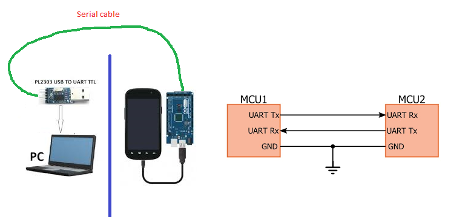

# How to use serial with Android phone
With the help of serial calbe, you can connect external device with Android phone.

## How to connect?
For exmaple, the external device is PC, connect them like this:

## Send data on PC
Run serial tool in PC like this:

Send wave data: `7D 7D 7D 7D 7D 7D 7D 7D 7D 7D 7D 7D 7D 7D 7D 7D 7D 7D 7D 7D 7D 7D 7D 7D 7D 7D 7D 7D 7D 7D 7D 7D 7D 7D 7D 7D 7D 7D 7D 7D 7D 7D 7D 7D 7D 7D 7D 7D 7D 7D 7D 7D 7D 7D 7D 7D 7D 7D 7D 7D 7D 7D 7D 7D 7D 7D 7D 7D 7D 7D 7D 7D 7D 7D 7D 7D 7D 7D 7D 7D 7D 7D 7D 7D 7D 7D 7D 7D 7D 7D 7D 7D 7D 7D 7D 7D 7D 7D 7D 7D 7D 7D 7D 7D 7D 7D 7D 7D 7D 7D 7D 7D 7E 7E 7F 81 81 82 82 83 84 84 84 84 83 82 82 81 81 7F 7F 7D 7D 7D 7D 7D 7D 7D 7D 7D 7D 7D 7D 7D 7D 7D 7D 7D 7D 7D 7D 7D 7D 7D 7C 7B 7A 79 7A 82 89 91 98 9F A2 9B 94 8C 85 7E 78 79 7A 7B 7D 7D 7D 7D 7D 7D 7D 7D 7D 7D 7D 7D 7D 7D 7D 7D 7D 7D 7D 7D 7D 7D 7D 7D 7D 7D 7D 7D 7D 7D 7D 7D 7D 7D 7E 7F 7F 81 81 82 83 84 84 85 86 87 87 87 88 88 89 89 89 8A 8A 8A 8A 89 89 88 88 87 87 85 85 85 83 82 81 81 7F 7E 7E 7D 7D 7D 7D 7D 7D 7D 7D 7D`

## Receive data on Android phone
Double click APP, it will connect USB serial automaticlly.
